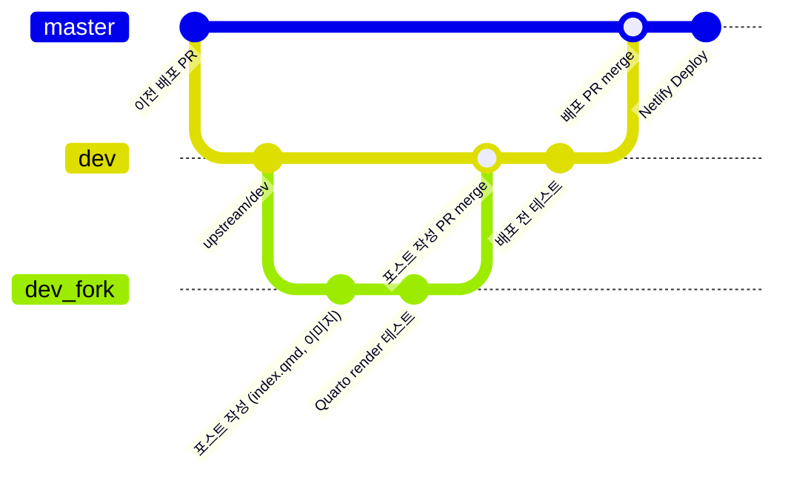

# Zarathu Blog

Zarathu Official Blog - <https://blog.zarathu.com>

[](https://blog.zarathu.com) [](https://app.netlify.com/sites/zarathublog/deploys) [](https://github.com/zarathucorp/blog/issues) [](https://github.com/zarathucorp/blog/blob/master/LICENSE)

## 운영 프로세스

### 브랜치 전략

- `dev`: 팀 공용 검증 브랜치입니다. GitHub Actions가 여기서 Quarto 렌더 테스트를 수행합니다.
- 작성자 브랜치: 포크 저장소에서 `dev`를 기반으로 `post/YYYY-MM-DD-title` 등 자유로운 이름으로 분기합니다. 최종 머지 대상은 항상 원본 저장소의 `dev`입니다.
- `master`: 프로덕션 배포용 브랜치입니다. `dev` 가 리뷰 완료되면 `master`로 머지 해 배포합니다.

### 작성자(Writer) 플로우

- GitHub에서 저장소를 포크하고 로컬에 클론합니다.
- 포크 저장소에서 `dev` 브랜치를 체크아웃한 뒤 작업합니다.
  ```bash
  git checkout dev
  ```
- `posts/YYYY-MM-DD-title/index.qmd`와 필요한 부자재(img 등)만 수정합니다. 로컬에서 개별 포스트를 `quarto render`로 테스트해 정상 작동하는지만 확인합니다. `_freeze/`와 `_site/`는 커밋하지 않습니다.
- 커밋 후 포크 저장소에 푸시하고, 원본 저장소의 `dev` 브랜치를 대상으로 PR을 생성해 글 요약과 검토 요청 사항을 남깁니다.

### 리뷰어(Reviewer) 플로우

- PR 브랜치를 체크아웃한 뒤 로컬에서 렌더해 수정 내용이 정상 출력되는지 확인합니다.
- 문제가 없다면 GitHub에서 PR을 승인하고 `dev`에 머지합니다.
- 머지 완료 후 자동으로 실행되는 GitHub Actions가 `_freeze/`를 최신화하고 결과를 커밋합니다. (봇 커밋이 다시 워크플로를 재실행하지 않도록 설정되어 있습니다.)
- Netlify `dev` 배포 URL에서 렌더 결과를 검증한 뒤 이상이 없으면 `master`에 머지합니다.

### 배포(Deploy) 플로우

- GitHub Actions `Quarto Publish` 워크플로는 `dev` 브랜치에 푸시될 때 실행되어 시스템 라이브러리 설치, `_install_packages.R` 실행, Python 의존성 설치, 그리고 Quarto ko/en/jp 렌더를 차례대로 수행합니다.
- 마지막으로 Netlify 자동 배포가 이루어집니다.

### 버전·배포 흐름 요약 (Mermaid)



## 포스트 작성자 (Writer) 참고사항

### 아티클 추가 하는 방법

1.  개인 계정으로 zarathucorp/blog 를 **Fork**
2.  로컬에 **Clone**
3.  Rstudio에서 **blog/zarathucorp.Rproj**을 열기
4.  **blog/posts**로 이동
5.  아티클을 담을 디렉토리 **생성**, 이때 형식은 `YYYY-MM-DD-TITLE` (다른 예시 참조)
6.  생성한 디렉토리로 이동 후 `index.qmd` 생성 후 Terminal에 `pip install Pyyaml` 실행
7.  YAML 작성 예시 (render 에러가 날 경우 **Indent**, **tab** 확인)
    수정 해야 하는 것은 `title`, `description`, `categories`, `author`, `date`이고, 이중 `categories`는 한 개 이상 작성해야 함

> [!IMPORTANT]  
> categories는 R이나 API 와 같이 대문자가 원어인 경우를 제외하고 전부 소문자로 표기

```{yaml}
---
title: "pkgdown을 활용한 R 패키지 문서화"
description: |
  R 패키지를 다른 사람들도 잘 활용할 수 있게 설명해주는 웹사이트를 pkgdown을 사용하여 만들어보자
categories:
  - R
  - rpackage
  - pkgdown
  - githubpage
  - documentation
  - website
author:
  name: "Jinhwan Kim"
  email: jinhwan@zarathu.com
  url: https://github.com/jhk0530
image: img/logo.png
fig_width: 400
date: 2023-03-15
format: html
execute:
  freeze: true
draft: false
license: CC BY-NC
---
```

8.  아티클을 `index.qmd`에 이어서 작성 (이미지는 디렉토리내 `/img`를 활용하길 권장)
9.  Terminal을 통해 해당 위치로 이동 후 `quarto render` 실행

```bash
cd posts/{YYYY-MM-DD-TITLE}
quarto render
```

10. 렌더 성공 시 **Commit** (_site/posts/{YYYY-MM-DD-TITLE}/index.html 에서 미리보기 가능)
11. zarathucorp/blog의 `dev` 브랜치에 **Pull Request** 생성 (`master` 브랜치에 PR 하지 않게 주의)
12. 끝 (Merge x)

### 아티클에 revealjs (quarto 슬라이드) 올리는 방법

> **2023-02-01-streamlit** 디렉토리 참조

1.  생성한 디렉토리에 추가로 **슬라이드 qmd 파일 작성**

2.  Terminal을 통해 해당 위치로 이동 후 `quarto render {SLIDE_TITLE}.qmd` 실행

```bash
cd posts/YYYY-MM-DD-TITLE
quarto render {SLIDE_TITLE}.qmd
```

3.  `index.qmd` 에 아래의 예시를 참조하여 iframe 추가

- src에 `/posts` 추가한 **슬라이드 qmd의 html결과를 참조**하게 함
- 슬라이드 qmd에서는 **반드시 yaml에 draft: true** 있어야 함.

```
<iframe class="slide-deck" src="/posts/2023-02-01-streamlit/streamlit_slide.html" width="750px" height="500px" style="border: solid 1px black">

</iframe>
```

```{YAML}
---
format:
  revealjs:
    theme: default
    incremental: true
    auto-animate-easing: ease-in-out
    auto-animate-unmatched: false
    auto-animate-duration: 0.8
    transition: slide
    background-transition: fade
    chalkboard:
      theme: whiteboard
      boardmarker-width: 5
      buttons: false
    standalone: true
execute:
  freeze: true

draft: true
---

```

### 아티클에 webR 추가하는 방법

1.  qmd 파일에 아래 내용 추가

````html
## webR Test ```{=html}
<link rel="stylesheet" href="../../webr/codemirror.min.css" />
<script src="../../webr/codemirror.min.js"></script>
<script src="../../webr/r.js"></script>
<script src="webr-worker.js"></script>
<script src="webr-serviceworker.js"></script>
<script type="module" src="editor.js"></script>

<h4>Editor</h4>
<div id="editor"></div>

<p style="text-align:right;">
  <button class="btn btn-success btn-sm" type="button" id="runButton">
    Loading webR...
  </button>
</p>

<h4>Result</h4>
<pre><code id="out"></code></pre>
````

2.  qmd가 위치한 디렉토리 (`YYYY-MM-DD`)에 `blog/webR` 디렉토리에서 3개 파일 복사

- `webr-worker.js`
- `webr-serviceworker.js`
- `editor.js`

3.  복사한 `editor.js` 에서 초기 코드 수정 6번째 줄, `value: ...` 이때 코드의 줄구분은 **엔터 대신 \n**으로 표기 해야함
